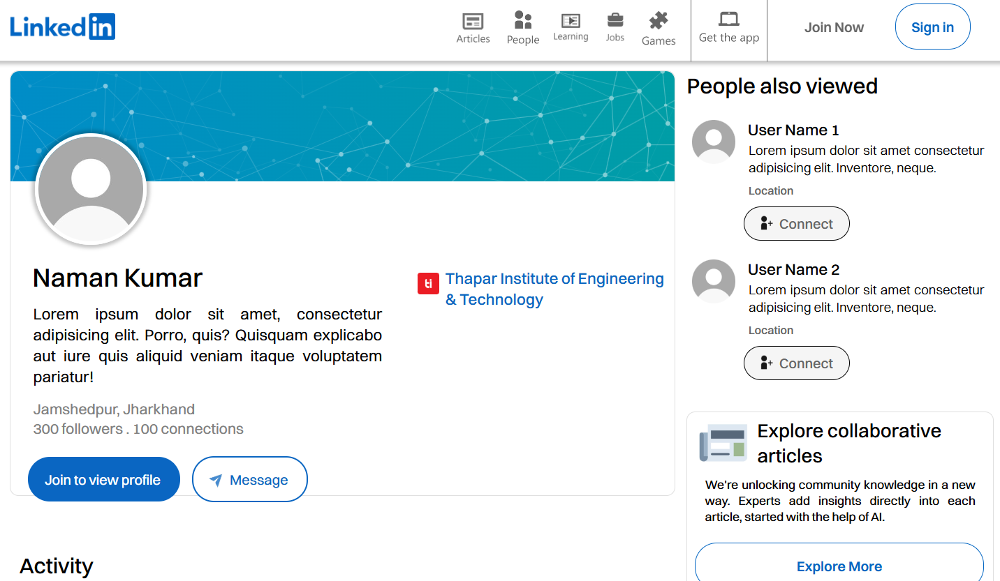

# 💻 LinkedIn Webpage Clone | HTML & CSS

A **static clone** of the **LinkedIn user profile page** built using pure HTML and CSS. This beginner-friendly project focuses on foundational web development practices like layout creation, styling with traditional CSS, and semantic HTML structuring.

🔗 **Live Webpage:** [Click Here](https://githubnaman259.github.io/Linkedin_Clone/)

---

## 🔍 Overview

- 🌐 **Tech Stack**: HTML5 & CSS3 (No JavaScript, no frameworks)
- 🎯 **Purpose**: To practice layout cloning, positioning, and clean code structure.
- 📐 **Design Note**: This project is **non-responsive** and optimized for **desktop view only**.
- ✨ **Best viewed at screen resolution: `1519 x 730`**

---

## 📸 Preview

---

## 📁 Features

- 🔷 Accurate replication of LinkedIn profile layout
- 🧭 Fixed navigation bar with functional icons and buttons
- 👤 Profile overview with name, intro, experience, and education
- 📑 Activity section and sidebar recommendations
- 🧹 Organized HTML and CSS using semantic structure and comments

---
